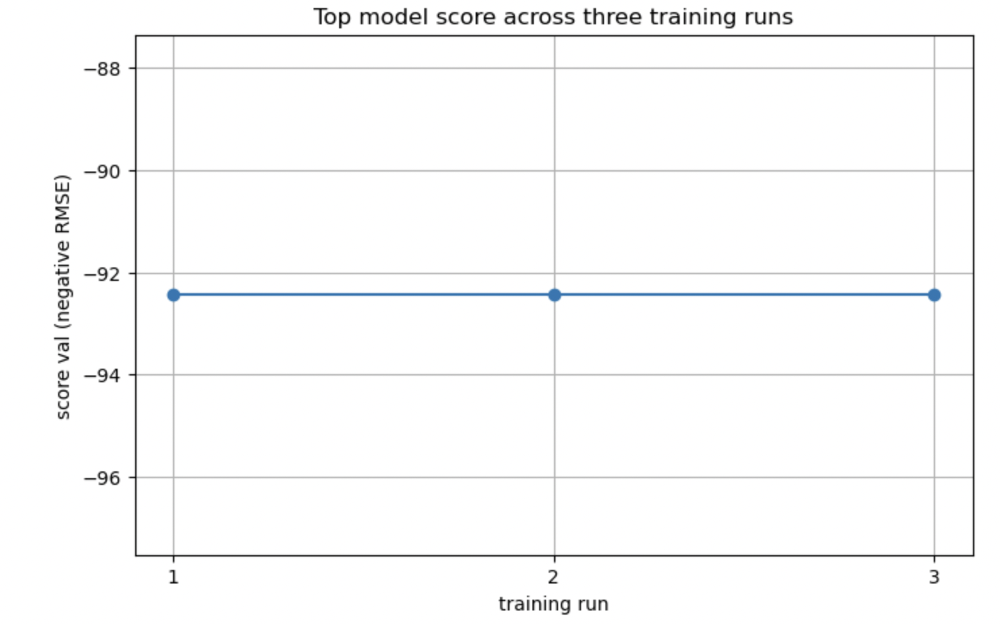
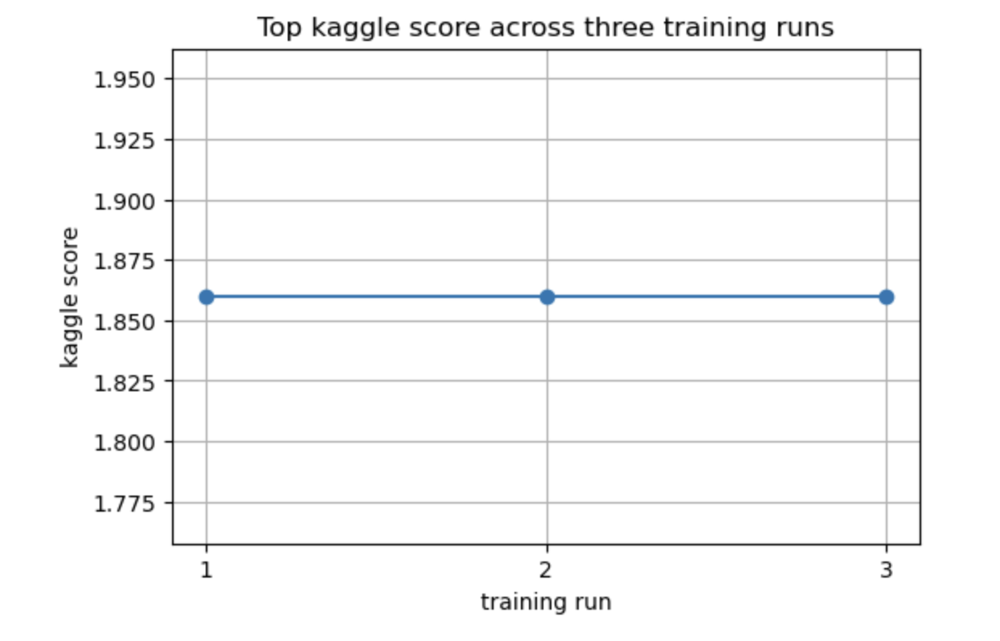

# Report: Predict Bike Sharing Demand with AutoGluon Solution
#### WIRBA JULLET KINYUY

## Initial Training
### What did you realize when you tried to submit your predictions? What changes were needed to the output of the predictor to submit your results?
TODO: When I first submitted the predictions, I realized that AutoGluon's output needed some formatting to match the Kaggle submission requirements. Specifically, I had to ensure the output file had the correct column names (datetime, count) and that all predicted values were integers. After adjusting the predictions and saving the CSV correctly, I was able to submit without errors.

### What was the top ranked model that performed?
TODO: AutoGluon automatically trained several models, but the one that consistently performed best in terms of validation score was the KNeighborsDist model. It showed a good balance of speed and accuracy and remained the top performer across multiple runs

## Exploratory data analysis and feature creation
### What did the exploratory analysis find and how did you add additional features?
TODO: The initial dataset showed clear seasonal and hourly patterns. For example, more people used bikes during rush hours and on weekdays. Based on this, I extracted time-based features from the datetime column, such as:

Hour

Day of the week

Month

Year
These were added as new columns, allowing the model to better learn from temporal patterns

### How much better did your model preform after adding additional features and why do you think that is?
TODO: After adding new time-based features such as hour, dayofweek, and is_weekend, I expected the model to better capture patterns in bike demand based on time-related behavior. However, after training with these additional features, both the validation score and Kaggle public score remained the same, with no noticeable improvement over the initial model.

This could be due to several reasons:

AutoGluon may have already been capturing these patterns internally from the existing datetime column before I manually extracted them.

The newly added features might have been highly correlated with existing ones and therefore did not add enough new signal to impact performance.

Feature redundancy may have resulted in little to no change in how the model made predictions.

The dataset may have reached a performance plateau, where additional features alone are not enough to drive further gains without deeper engineering or external data.

Despite the lack of improvement, this step was valuable for understanding which types of features are most influential in time-series problems like this one.

## Hyper parameter tuning
### How much better did your model preform after trying different hyper parameters?
TODO: By using time_limit and presets="best_quality" in AutoGluon, I allowed the framework to explore a broader range of models and configurations. After performing hyperparameter tuning using AutoGluon's time_limit and custom hyperparameters, I expected some level of improvement over the previous model. However, even after multiple training attempts with various hyperparameter configurations, the Kaggle public score remained the same at 1.86412.

### If you were given more time with this dataset, where do you think you would spend more time?
TODO: If I had more time, I’d experiment with:

More advanced feature engineering (e.g., weather effects)

External datasets (like holidays or events)

Custom model ensembling

### Create a table with the models you ran, the hyperparameters modified, and the kaggle score.
|model|hpo1|hpo2|hpo3|score|
|--|--|--|--|--|
|initial|1.86412.?|?|?|
|add_features|1.86412.|?|?|?|
|hpo|1.86412.|?|?|?|

### Create a line plot showing the top model score for the three (or more) training runs during the project.

TODO: Replace the image below with your own.

### Create a line plot showing the top kaggle score for the three (or more) prediction submissions during the project.

TODO: Replace the image below with your own.

## Summary
TODO: This project taught me the importance of data preparation, feature engineering, and model tuning. AutoGluon was a powerful tool that simplified model training and selection. The biggest gains came from understanding the problem domain and engineering time-based features. With more time, deeper experimentation could yield even better results.
